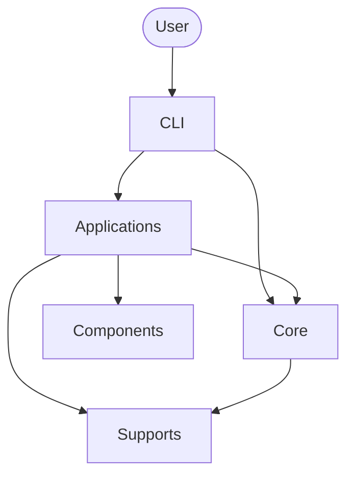
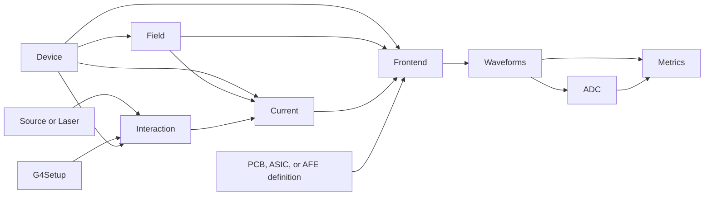

# Architecture and data paths

_RASER 5.0 code layers, projects, and scientific data flow_

RASER separates reusable scientific calculations from applications that
assemble a sensor study or test scenario. Generated data is stored with the
project that defines its meaning.

## Code layers



The CLI routes commands. Applications assemble complete calculations. An
application project uses Components to select a Device, PCB, or ASIC project,
place their geometries through a G4Setup, and connect the Source, Laser, AFE,
or ADC used by the scenario. Core contains reusable scientific calculations.
Supports provides project paths, run records, and shared execution utilities.

The installed package follows this layout:

```text
src/raser/
├── cli/
├── apps/
├── components/
├── core/
└── supports/
```

## Project types

RASER uses one project form for research on a sensor and another for a sensor
application or test scenario.

A sensor project contains the Device definition, its default state, and
reusable products derived for that sensor. Field configurations and their
calculated data are stored under the Device project.

An application project records the Device and operating state selected for a
scenario through its Device component. Its runs contain products that also
depend on the particle source, scan, electronics, or analysis configuration.

Products defined by a sensor configuration are stored with Device. Products
that also depend on an application scenario are stored with that application.
The detailed storage contracts are defined by [Device](core/device.md),
[Field](core/field.md), [Device components](components/device.md), and
[Run records](supports/runs.md).

## Scientific data flow



Device supplies the sensor definition and resolved operating state. Field
calculates or loads the electrostatic, transport, weighting, and AC data for
that state. Interaction combines the Device geometry or an application
G4Setup with a Source or Laser and supplies carrier creation positions and
populations.

Current transports those populations and produces one instantaneous induced
current source for each readout electrode. Frontend turns Device values or
Field AC data into a sensor netlist, then connects that netlist, the induced
current sources, and the selected AFE in one circuit calculation.

Metrics receives analog waveforms or ADC samples together with the readout
layout and analysis settings. Applications select the calculations, pass their
explicit inputs, and store the resulting run products.

## Core documents

The scientific definitions are maintained in the corresponding Core pages:

- [Device](core/device.md)
- [Field](core/field.md)
- [Interaction](core/interaction.md)
- [Current](core/current.md)
- [Frontend](core/frontend.md)
- [Metrics](core/metrics.md)

PCB, ASIC, and ADC remain design drafts under `docs/core/draft/`.
