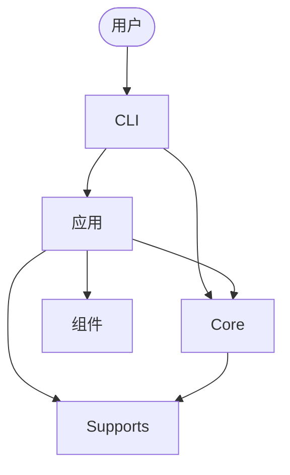
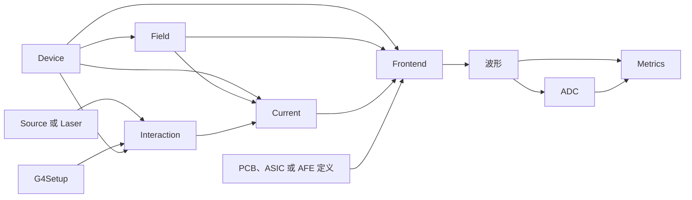

# 架构与数据路径

_RASER 5.0 的代码分层、项目与科学数据流_

RASER 将可复用的科学计算与组装传感器研究或测试场景的应用分开。生成的数据保存在定义其含义的项目中。

## 代码分层



CLI 路由命令。应用组装完整计算。应用项目使用组件选择 Device、PCB 或 ASIC 项目，通过 G4Setup 放置其几何，并连接场景所用的 Source、Laser、AFE 或 ADC。Core 包含可复用的科学计算。Supports 提供项目路径、运行记录与共享执行工具。

安装后的软件包采用以下布局：

```text
src/raser/
├── cli/
├── apps/
├── components/
├── core/
└── supports/
```

## 项目类型

RASER 分别组织传感器自身研究，以及传感器应用或测试场景。

传感器项目包含 Device 定义、默认状态和由该传感器产生的可复用产物。Field 配置及其计算数据保存在 Device 项目下。

应用项目通过 Device 组件记录场景所选的 Device 与工作状态。其运行产物还取决于粒子源、扫描、电子学或分析配置。

由传感器配置定义的产物保存在 Device 中。还依赖应用场景的产物保存在相应应用中。具体存储契约见 [Device](core/device.md)、[Field](core/field.md)、[Device 组件](components/device.md)与[运行记录](supports/runs.md)。

## 科学数据流



Device 提供传感器定义和解析后的工作状态。Field 为该状态计算或加载静电、输运、权重场与 AC 数据。Interaction 将 Device 几何或应用 G4Setup 与 Source 或 Laser 组合，并提供载流子产生位置和数量。

Current 输运这些载流子，并为每个读出电极产生一个瞬时感应电流源。Frontend 根据 Device 数值或 Field AC 数据生成传感器网表，再在同一电路计算中连接该网表、感应电流源和所选 AFE。

Metrics 接收模拟波形或 ADC 样本，以及读出布局与分析设置。应用选择计算、传入明确输入，并保存产生的运行产物。

## Core 文档

科学定义维护在相应 Core 页面中：

- [Device](core/device.md)
- [Field](core/field.md)
- [Interaction](core/interaction.md)
- [Current](core/current.md)
- [Frontend](core/frontend.md)
- [Metrics](core/metrics.md)

PCB、ASIC 和 ADC 设计草稿位于 `docs/core/draft/`。
