# RASER CLI router

_RASER 5.0 command parsing, dispatch context, and process-exit semantics_

---

## 📋 Scope

The installed `raser` entry point owns command syntax and dispatch. It converts
an argument vector into one selected application or Core capability and
keeps command-line concerns outside scientific code.

| Area | CLI responsibility | Downstream responsibility |
| --- | --- | --- |
| **Syntax** | Parse commands, options, and values | Interpret scientific meaning |
| **Route** | Select one registered module and callable | Execute the selected capability |
| **Context** | Activate project and application component roots | Resolve inputs through Supports |
| **Batch** | Recognize whole-command submission | Choose workflow fan-out and collection |
| **Exit** | Return the selected status and guarantee cleanup | Raise or return a visible failure |

Detector construction, physical defaults, result interpretation, and workflow
execution belong to the selected application or Core capability. The CLI
provides routing interfaces internally and exposes the installed `raser`
command described in the [CLI overview](README.md).

## 📥 Inputs and outputs

### Inputs

| Input | Contract |
| --- | --- |
| **Argument vector** | Ordered tokens passed to `raser`; tokens remain structured through dispatch |
| **Route registry** | Command group, command prefix, target module, callable, and argument projection |
| **Runtime environment** | Initial work, project, component, container, and external-runtime settings |

Parser defaults are limited to command syntax. Application configuration and
scientific defaults are resolved after dispatch by the owning application.

### Outputs

A valid invocation produces exactly one of these outcomes:

| Outcome | Result |
| --- | --- |
| **Direct dispatch** | One selected callable is invoked once |
| **Global batch** | One complete `raser` command is submitted once |
| **Help** | Help text is printed before any application import |
| **Failure** | A non-zero status or exception reaches the caller |

The CLI restores temporary environment context before it returns. The selected
application or Core capability owns every generated scientific artifact.

## ⚙️ Dispatch lifecycle

```mermaid
flowchart LR
    accTitle: RASER CLI Dispatch Lifecycle
    accDescr: A command is parsed, routed, given temporary project and component context, dispatched through one lazy import, and cleaned up before its status is returned.

    receive_args([📥 Receive argument tokens]) --> parse_command[⚙️ Parse command syntax]
    parse_command --> select_route[📋 Select one route]
    select_route --> activate_context[🔧 Activate runtime context]
    activate_context --> derive_arguments[⚙️ Derive contextual arguments]
    derive_arguments --> import_entry[📦 Import selected entry]
    import_entry --> invoke_entry[⚡ Invoke selected callable]
    invoke_entry --> release_runtime[🔧 Release runtime resources]
    release_runtime --> return_status([✅ Return entry status])
```



Cleanup runs for successful calls, rejected inputs, downstream exceptions, and
submission failures. It restores the previous project and component variables
and releases process-global Geant4 managers in dependency-safe order when they
were loaded.

## 🔗 Dependency direction

The router may import Supports at startup and lazily import the selected
application or Core entry. Lazy imports confine heavy scientific runtimes to
the selected entry.

```text
user -> CLI -> selected application -> Core
           \-> selected Core capability
           \-> Supports
```

The dependency rules are:

- dependency edges point from the CLI toward Applications and Core
- applications receive the parsed top-level argument values
- Python import state comes from the installed package and active environment
- each route names one concrete module and callable
- Core capabilities are exposed through their corresponding top-level commands

Project inference and component lookup are defined in
[Runtime paths](../supports/paths.md). Workflow fan-out is defined in
[Jobs](../supports/jobs.md).

## 📦 Route descriptor

Each terminal parser registers a complete dispatch descriptor:

| Field | Meaning |
| --- | --- |
| **Command** | Stable owning command such as `signal`, `field`, or `metrics` |
| **Group** | Application or Core capability |
| **Prefix** | Tokens that identify the worker command during fan-out |
| **Module** | One importable target module |
| **Callable** | One function on that module |
| **Projection** | Parsed values passed positionally, or the complete parsed request |
| **Context selector** | Project input and application component roots required by the route |

Missing descriptor fields are registration errors. Dispatch invokes the exact
module and callable recorded by the selected descriptor.

## ⚙️ Batch boundaries

The two batch surfaces have different owners:

| Surface | Owner | Contract |
| --- | --- | --- |
| **Global batch** | CLI | Submit the complete selected command once |
| **Indexed jobs** | Application | Expand one logical run into indexed workers |

Global batch preparation removes the CLI control tokens and preserves every
remaining command token until the cluster adapter serializes the job file.
Indexed workers receive the same route prefix and normalized run ID, plus one
unique job index.

## ⚠️ Failure semantics

| Failure | Required behavior |
| --- | --- |
| **Invalid syntax** | Print parser diagnostics and exit with status `2` |
| **Missing command** | Print top-level help and return status `1` |
| **Unknown route target** | Raise the original import or attribute error |
| **Entry rejection** | Preserve the entry's explicit non-zero status |
| **Entry exception** | Restore context, release runtime resources, and re-raise |
| **Batch rejection** | Return the submission failure and identify partial submission |
| **Cleanup failure** | Surface the cleanup error and return failure |

Every failed application, worker, or scheduler operation reaches the process
boundary with a failure status.
