# Run records

_RASER 5.0 run configuration and identity in `src/raser/supports/runs.py`_

---

## 📋 Responsibility

Runs turns an application-supplied normalized specification into an immutable
execution record and resolves explicit or latest compatible runs. Applications
own workflow defaults and result schemas; scientific objects validate their
own values; Jobs executes workers.

## ⚙️ Configuration precedence

Workflow values resolve in this order:

1. explicit command values
2. named or explicit run configuration
3. values stored by the project component
4. defaults owned by the referenced Device or other reusable object
5. generic defaults owned by the application

A named configuration resolves to `<project>/config/<name>.json`; an explicit
file is read from its given path. Configuration fills unspecified values while
preserving the route's selected project context.

## 📥 Normalized specification

| Field | Contract |
| --- | --- |
| Workflow | Owning workflow and output namespace |
| Component references | Project component and referenced Device, source, or electronics identities |
| Device state | Resolved bias, temperature, and irradiation state |
| Field configuration | Resolved bias, temperature, irradiation, dimension, source, and source-specific settings |
| Field data | Hash of the complete Field configuration used to address the Device-owned assets |
| Work allocation | Events per worker and planned worker count |
| Electronics | Selected PCB, ASIC, AFE, and ADC identities when applicable |
| Run identity | Explicit ID or newly allocated ID with creation time |
| Provenance | Resolved sources, code revision, and working-tree state when available |

The specification contains normalized primitive values. `run.json` is written
once before fan-out and remains immutable throughout execution.

## 📦 Envelope and selection

```text
<project>/<workflow>/<run_id>/
├── run.json
├── batch/
└── analysis/
```

Each worker writes its indexed artifacts under `batch/`. The owning
application creates `analysis/` after validating the record and all required
worker outputs.

`latest` is a transient read selector. Persisted records carry an allocated run
ID. The selector filters compatible records by requested metadata and returns
the newest unique match. An explicit path selects exactly that run directory.

## 🔄 Lifecycle

```mermaid
flowchart LR
    accTitle: RASER run record lifecycle
    accDescr: An application normalizes inputs, reserves one run, writes its immutable record, executes indexed jobs, and separately validates artifacts before analysis.

    inputs([Receive workflow inputs]) --> normalize[Normalize specification]
    normalize --> reserve[Reserve unique run]
    reserve --> record[Write immutable run.json]
    record --> jobs[Execute or submit indexed jobs]
    jobs --> batch[(Batch artifacts)]
    batch --> collect[Application validates and collects]
    collect --> analysis([Analysis artifacts])
```



Job execution is defined in [Jobs](jobs.md); artifact locations follow
[Output](output.md).

## ⚠️ Failure contract

Invalid configuration fails before run reservation. Incomplete specifications
name the missing field. Identity collisions fail before writing. Missing or
ambiguous selection raises an explicit error. Failures after reservation
preserve the run directory and record.
